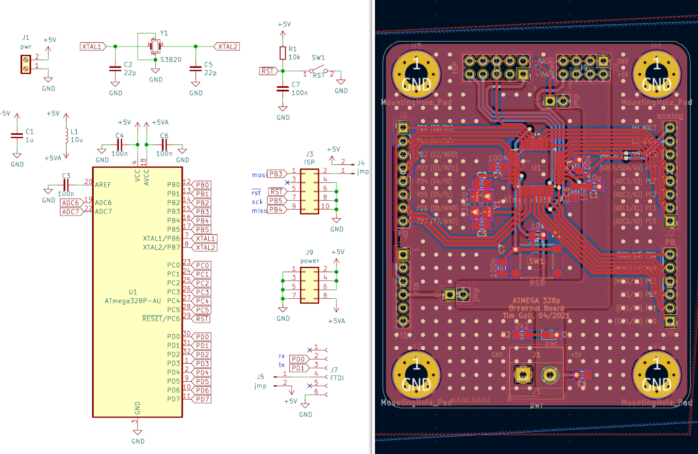
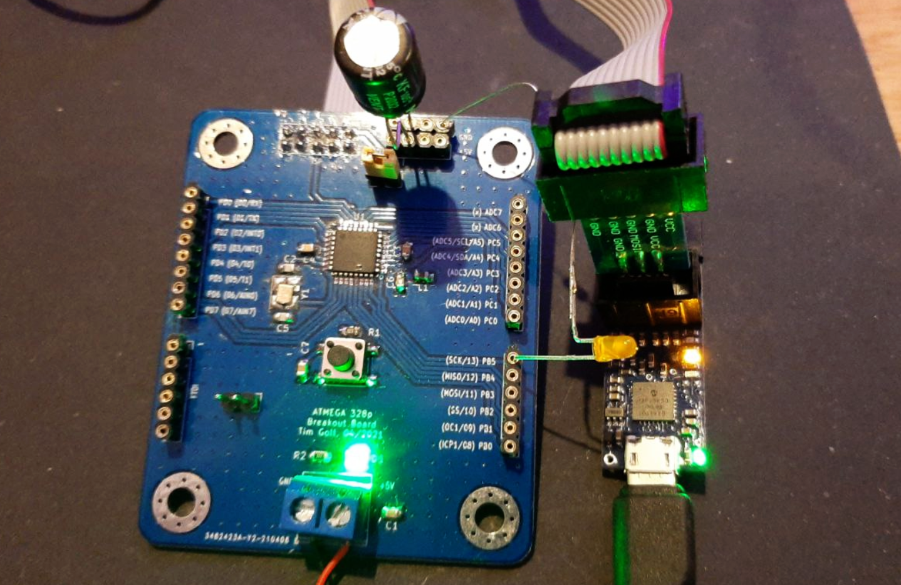
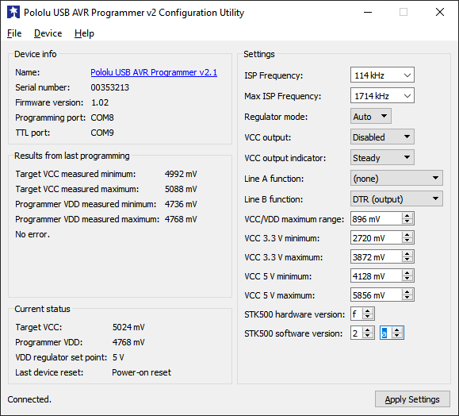
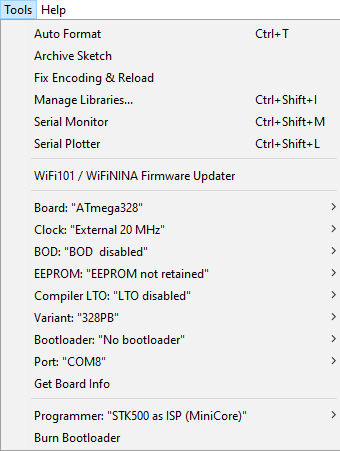

# PCB Atmega328PB

The board's design is heavily based on the design of the Arduino Uno. All the USB communication stuff was removed. The board is therefore reduced to its bare minimum. The most notable deviation in comparison to the Arduino Uno is that my board uses a 20MHz crystal.


_(The schematic and the PCB I created from this schematic)_

The board is a two layer design with mostly ground planes that are stitched together with multiple vias. All the relevant parts are mounted to the front side.


_(The finished PCB aith the programmer next to it)_

The design of the board works like intended with the one issue, that the ISP connector is mirrored. This however is fixed in the current version in this repository.

## Setup

This board has to be programmed with an ISP connection located on the board. There are different programmers available, I'm using the [Pololu USB AVR Programmer v2.1](https://www.pololu.com/product/3172). The driver package should be installed as it comes with a nice tool to look at the programmer.

A working programmer looks something like this. Do note here that I'm using an external power supply for the MCU here.



If the board is connected, `avrdude` can be used to read the info of the MCU. Use `./avrdude.exe` in the command line while being in the correct folder, for me it is: `C:\Program Files (x86)\Arduino\hardware\tools\avr\bin`.

Use the following command to read the board information:

```sh
./avrdude.exe -C ../etc/avrdude.conf -c stk500 -P COM8 -b 19200 -p m328pb -v
```

`COM8` is used here because it is the programming port of this programmer, `stk500` is the type of the programmer. See [this article](http://www.s6z.de/cms/index.php/arduino/nuetzliches/31-usb-isp-programmer-fuer-atmel-avr-usbasp) for more information on this.

To use an external crystal, the fuses of the board have to be set. The fuse bits can be easily set with the [AVR fuse calculator](https://eleccelerator.com/fusecalc/fusecalc.php?chip=atmega328p&LOW=DE&HIGH=D9&EXTENDED=FF&LOCKBIT=FF). They then have to be flashed to the board. The command is mostly the same, only the `-v` gets replaced by the fuse byte command from the website.

Now the board can be flashed with the desired software. There are different ways to do this, but if the Arduino IDE should be used, a few things have to be set up.

First [MiniCore](https://github.com/MCUdude/MiniCore) has to be added as it features a few more missing AVRs with UI based configurability. The json file link had to be added in the Arduino Settings page as described in the project's readme.



These are the settings that were used here for this specific board setup. It can be easily verified by uploading a simple LED blink sketch.
